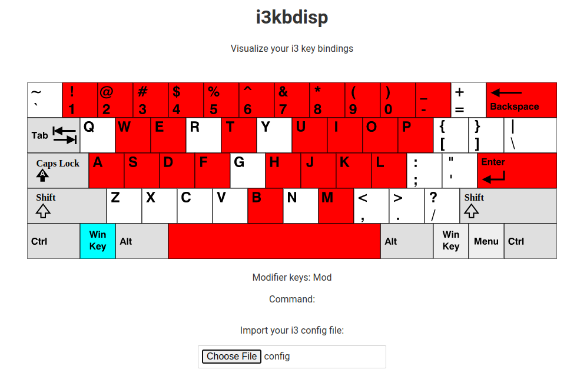

<h1 align="center">
    i3kbdisp
</h1>

> Visualize your i3 key bindings
<div align="center">
    
</div>

Have you ever wanted to add a new key binding but not knowing which key to choose
? Have you ever wanted to remap keys ? Or have you ever ever wanted to optimize
your workflow and key bindings ? Well this app is just for you! It allows you to
easily visualize your key bindings.


The app is available at https://i3kbdisp.trayzen.xyz.

## Requirements
- [Node.js](https://nodejs.org/)
- [pnpm](https://pnpm.io/)

## Building
```sh
pnpm install
pnpm run build
```

## Glossary
**Key binding**: The assignment of a key or combination of keys on keyboard with
a command

**Keymapping**: A mapping of keys on a keyboard to commands; a key binding.

**Keyboard layout**: A keyboard layout is any specific physical visual or
functional arrangement of the keys, legends, or key-meaning assocations of a
computer keyboard, mobile phone or other computer-controlled typographic
keyboard.

**Modifier key**: A modifier key is a special key (or combination) on a computer
keyboard that temporarily modifies the normal action of antother key when
pressed together.

## Contributing
Contributions are welcome! Just [submit a pull request](https://github.com/TrAyZeN/i3kbdisp/compare).

If you want to report a bug or request a feature just [open an issue](https://github.com/TrAyZeN/i3kbdisp/issues/new).

## License
This project is licensed under [MIT License](https://github.com/TrAyZeN/i3kbdisp/blob/master/LICENSE).
